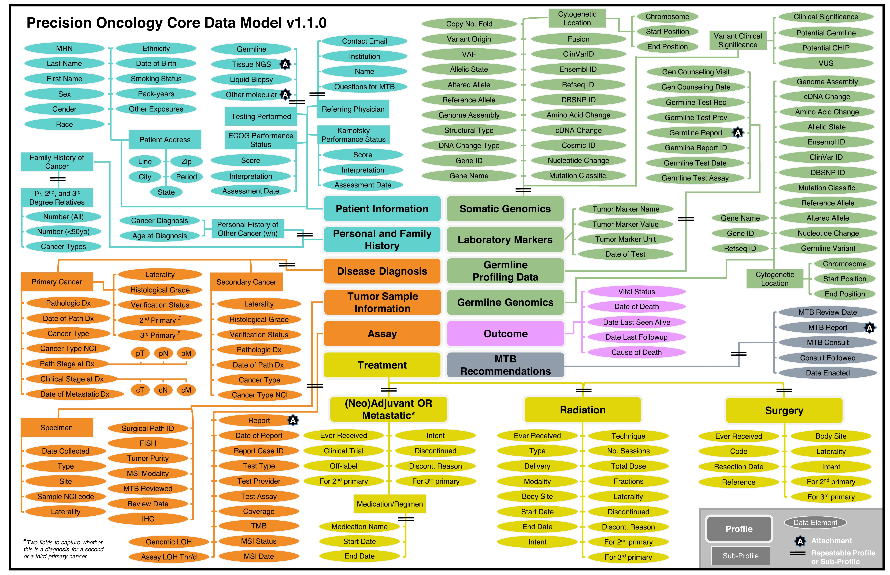

# Precision Oncology Core Data Model
{: .fs-8 }

The Sidney Kimmel Comprehensive Cancer Center at the Johns Hopkins University has developed the **Precision Oncology Core Data Model (Precision-DM**) to support data standardization, improve harmonization and organization, enable automated retrieval of genomic and clinical features, and facilitate data transfer within and across institutions.
{: .fs-6 .fw-300 }

{: .new }
> **Latest version `1.1.0` is available!**

> The structure of Precision-DM, including the profiles, sub-profiles, and data elements, is illustrated in the following diagram.
> See [Precision-DM Versions](docs/ui-components) for a detailed description of the latest version.
> 

[View it on GitHub](https://github.com/just-the-docs/just-the-docs){: .btn .fs-5 .mb-4 .mb-md-0 }

## About the project

Precision-DM is &copy; 2022-{{ "now" | date: "%Y" }} by [The Johns Hopkins University School of Medicine](https://www.hopkinsmedicine.org/som/).

### License

Precision-DM is distributed by an [MIT license](https://github.com/just-the-docs/just-the-docs/tree/main/LICENSE.txt).

### Contributing

If you wish to contribute to [our GitHub repo](https://github.com/just-the-docs/just-the-docs#contributing) and Precision-DM efforts, please first discuss via email or other method with our team.

#### Thank you to the contributors of Just the Docs!

